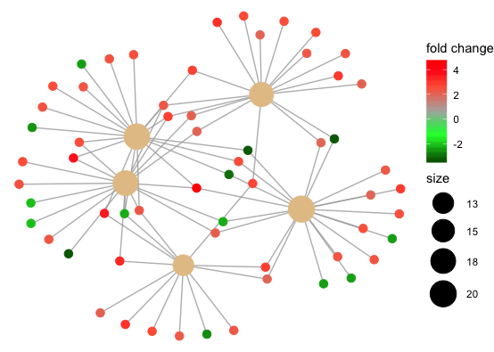

# 探索和修改ggplot对象
## 目的

使用ggplot画图时难免会遇到写死的函数，这些函数的作图大体符合我们的要求，但是某些细节可能不是我们想要的。比如想要重新调整lable，改变图形的布局 (layout)等等。

为了进行微调，需要对ggplot object进行探索和修改。

案例
<https://support.bioconductor.org/p/127688/>
```r
 library(DOSE) 
 data(geneList) 
 de <- names(geneList)[abs(geneList) > 2] 
 edo <- enrichDGN(de)
 library(enrichplot)
 barplot(edo, showCategory=20)
 edox <- setReadable(edo, 'org.Hs.eg.db', 'ENTREZID') 
 p1 <- cnetplot(edox, foldChange=geneList)
```


需要修改p1中的lables size。


## 涉及的包

`gginnards`:用于对`gg`object进行探索(Explore the innards of ‘ggplot2’);

`ggraph`:是对`ggplot`的拓展，可对涉及的网络、图表、树图(networks, graphs, and trees)进行修改；

### 安装

CRAN:
```r
install.packages('gginnards')
install.packages('ggraph')
```

Github
```r
devtools::install_bitbucket('aphalo/gginnards')
devtools::install_github('thomasp85/ggraph')
```


## 探索`gg` object(gginnards的简单应用)

```r
library(gginnards)
```

`geom_debug()`将接收到的`gg` object作为输出返回到R console 上，生成的data.fram记录了geometries 和statistics的信息。
```r
ggplot(mtcars, aes(cyl, mpg, color = mpg)) +
  geom_point() +
  geom_debug()

```

```
# A tibble: 32 x 5
   colour      x     y PANEL group
   <chr>   <dbl> <dbl> <fct> <int>
 1 #30648F     6  21   1        -1
 2 #30648F     6  21   1        -1
 3 #356E9D     4  22.8 1        -1
 4 #316692     6  21.4 1        -1
 5 #29577E     8  18.7 1        -1
 6 #275379     6  18.1 1        -1
 7 #1D3F5E     8  14.3 1        -1
 8 #3977A9     4  24.4 1        -1
 9 #356E9D     4  22.8 1        -1
10 #2A5982     6  19.2 1        -1
# … with 22 more rows
```

### 对layers进行操作
`gginnards`包可对`gg` object中的图层进行查找、移动、删除、追加等操作。

`num_layers(p1)`:查看p1的图层数目；

`delete_layers(p1, "GeomTextRepel")`：删除p1的图层"GeomTextRepel"；

`append_layers(p1, geom_line(colour = "orange"), position = "top")`:添加新图层至顶层；

`move_layers(p1, "GeomTextRepel", position = "bottom")`:将"GeomTextRepel"图层移动至最底层，同理可调整参数position = "top"；

## 对ggplot网络图的扩展（ggraph的简单应用）
`ggraph`包是ggplot2的扩展，支持对ggplot2中networks,graphs，trees的扩展，包中有一套独立的geoms、facet集合。

在`ggraph`对网络图的定义中有三个核心要素：布局(Layout)、节点(Node)和边(Edges)。

+ Layout定义节点在图形中的位置，简而言之就是每个节点的x值和y值。
+ Nodes是网络图关系结构中的实体，可以使用`geom_node_*`函数家族绘制，如`geom_node_point()`
+ Edges关系结构中实体间的连接，可以用`geom_edge_*`函数家族绘制

### Layouts
`ggraph`提供多种不同的布局<https://ggraph.data-imaginist.com/articles/Layouts.html>
```r
library(ggraph)
library(tidygraph)

set_graph_style(plot_margin = margin(1,1,1,1))
graph <- as_tbl_graph(highschool)
```

```r
# Not specifying the layout - defaults to "auto"
ggraph(graph) + 
  geom_edge_link(aes(colour = factor(year))) + 
  geom_node_point()
```
 

```r
# A coord diagram
ggraph(graph, layout = 'linear', circular = TRUE) + 
  geom_edge_arc(aes(colour = factor(year))) + 
  coord_fixed()
```
 


### Nodes

前面介绍过节点是布局的实体表现，在下面没有使用`geom_edges_*`时体现的更清楚:
```r
ggraph(graph) + 
  geom_node_point()
```
 

Layouts已经将每个节点的x值和y值定义好的，geom_node_point的作用是将节点可视化。
```
> head(create_layout(graph, layout = "stress"))
          x         y circular name .ggraph.orig_index .ggraph.index
1 1.6569924 -1.040055    FALSE    1                  1             1
2 2.1286313 -1.097803    FALSE    2                  2             2
3 1.9633908 -1.646155    FALSE    3                  3             3
4 0.0909751  2.036662    FALSE    4                  4             4
5 0.8806997  1.829129    FALSE    5                  5             5
6 2.1544959  1.340999    FALSE    6                  6             6
```

geom_node_*()家族：

```r
gr <- tbl_graph(flare$vertices, flare$edges)
ggraph(gr, layout = 'treemap', weight = size) + 
  geom_node_tile(aes(fill = depth))
```
 

```r
ggraph(gr, layout = 'partition', circular = TRUE) + 
  geom_node_arc_bar(aes(fill = depth)) + 
   coord_fixed()
```
 

还有`geom_node_text()`和`geom_node_lable`继承于`geom_text`和`geom_lable`并在此基础上添加了`repel`参数，当`repel = TRUE`时，可以将文本位置进行微调以避免overlap。


### Edges

edges可以将图形结构中的节点位置连接即时这个节点没被可视化。
```r
hairball <- as_tbl_graph(highschool) %>% 
  mutate(
    year_pop = map_local(mode = 'in', .f = function(neighborhood, ...) {
      neighborhood %E>% pull(year) %>% table() %>% sort(decreasing = TRUE)
    }),
    pop_devel = map_chr(year_pop, function(pop) {
      if (length(pop) == 0 || length(unique(pop)) == 1) return('unchanged')
      switch(names(pop)[which.max(pop)],
             '1957' = 'decreased',
             '1958' = 'increased')
    }),
    popularity = map_dbl(year_pop, ~ .[1]) %|% 0
  ) %>% 
  activate(edges) %>% 
  mutate(year = as.character(year))

```

geom_edge_*()家族:
```r
ggraph(hairball, layout = 'stress') + 
  geom_edge_link(aes(colour = year))
```
 

edge最简单的用法是将节点直接连接起来，但是有时我们会像要知道节点见的overlap。

```r
ggraph(hairball, layout = 'stress') + 
  geom_edge_fan(aes(colour = year))
```
 

geom_edge_fan()会将两个节点间的edges进行计算，有overlaps时给予一定弧度。

```r
ggraph(hairball, layout = 'stress') + 
  geom_edge_parallel(aes(colour = year))
```
 

geom_edge_parallel(),另一种overlap的表现形式。

```r
loopy_hairball <- hairball %>% 
  bind_edges(tibble::tibble(from = 1:5, to = 1:5, year = rep('1957', 5)))
ggraph(loopy_hairball, layout = 'stress') + 
  geom_edge_link(aes(colour = year), alpha = 0.25) + 
  geom_edge_loop(aes(colour = year))
```
 

有时节点间没有长度，长度只存在于自身，比如上图学生的friendship调查，有学生只喜欢自己的话，就可以用闭形环表示。


## 案例分析
在开头提到了改变label size的问题<https://support.bioconductor.org/p/127688/>

```r
library(gginnards)
library(ggraph)
lapply(p1$layers, function(x) class(x$geom))
```

先来找到可视化文本的图层(GeomTextRepel)

```
> lapply(p1$layers, function(x) class(x$geom))
[[1]]
[1] "GeomEdgePath" "GeomPath"     "Geom"         "ggproto"      "gg"          

[[2]]
[1] "GeomPoint" "Geom"      "ggproto"   "gg"       

[[3]]
[1] "GeomTextRepel" "Geom"          "ggproto"       "gg"  
```

```r
 p2 <- delete_layers(p1, "GeomTextRepel")
```
 

用gginnards::gginnards把相应图层删除
 
```r
 p2 + geom_node_text(size = 2, aes_(label = ~name))
 
 p2 + geom_node_text(size = 2, aes_(label = ~name) , repel = T)
```
 
 

用ggraph::geom_node_text添加新的label,注意这里分别对比了`repel = T`和`repel = F`的情况。


