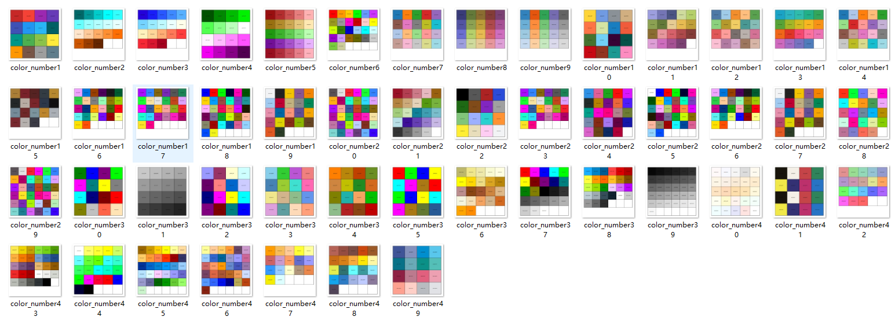
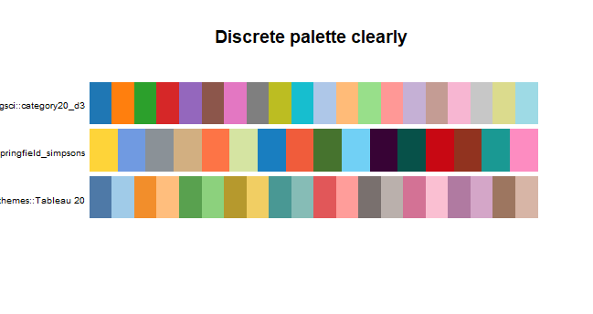
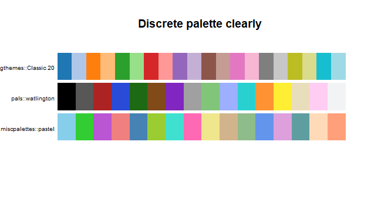

#  筛选收集配色方案

可视化中的一个老大难的问题是如何选择适合的配色方案。<br/>
这里通对`paletteer`包的探索来筛选出易于区分的离散型配色，用于将来的可视化工作中。

## 配色管家`paletteer` 

安装：

CRAN:

```r
install.packages("paletteer")
```

github:

```r
# install.packages("devtools")
devtools::install_github("EmilHvitfeldt/paletteer")
```

`paletteer`在持续收录了R中所用到的配色方案， <br/>
具体使用请参考：<https://emilhvitfeldt.github.io/paletteer/index.html>


##  导入sysdata
 
`paletteer`可以通过`paletteer_d(palette)`来调取对应包的颜色数值，在进行颜色筛选之前，请导入`paletteer`的**sysdata.rda**   <https://github.com/EmilHvitfeldt/paletteer/tree/master/R> , 里面包含3个values, 分别为`c_names`, `d_names`, `dym_names`


```r
load(sysdata.rda)
```
```
 head(d_names, n= 50)
 [1] "awtools::a_palette"          "awtools::bpalette"           "awtools::gpalette"           "awtools::mpalette"          
 [5] "awtools::spalette"           "basetheme::brutal"           "basetheme::clean"            "basetheme::dark"            
 [9] "basetheme::deepblue"         "basetheme::default"          "basetheme::ink"              "basetheme::minimal"         
[13] "basetheme::royal"            "basetheme::void"             "calecopal::sierra1"          "calecopal::sierra2"         
[17] "calecopal::chaparral1"       "calecopal::chaparral2"       "calecopal::chaparral3"       "calecopal::conifer"         
[21] "calecopal::desert"           "calecopal::wetland"          "calecopal::oak"              "calecopal::kelp1"           
[25] "calecopal::kelp2"            "calecopal::coastaldune1"     "calecopal::coastaldune2"     "calecopal::superbloom1"     
[29] "calecopal::superbloom2"      "calecopal::superbloom3"      "calecopal::sbchannel"        "calecopal::lake"            
[33] "calecopal::fire"             "calecopal::agriculture"      "calecopal::bigsur"           "calecopal::figmtn"          
[37] "colorblindr::OkabeIto"       "colorblindr::OkabeIto_black" "colRoz::grandis"             "colRoz::flavolineata"       
[41] "colRoz::whitei"              "colRoz::picta"               "colRoz::virgo"               "colRoz::ngadju"             
[45] "colRoz::c.decresii"          "colRoz::c.kingii"            "colRoz::e.leuraensis"        "colRoz::i.lesueurii"        
[49] "colRoz::l.boydii"            "colRoz::m.horridus"         
```
<br/>

## 筛选

接下来对所需的配色方案进行筛选，<br/>
这里我们想要筛选出离散型，数值大于15的配色,请参考以下代码：


```r
library(paletteer)

color_filter <- function(names = d_names, min = 15, max = 50) {
    leng_ma <- lapply(names, function(i) {
        length(paletteer_d(i))
    }) %>% do.call(rbind, .)

    len_df <- as.data.frame(leng_ma) ##配色方案的长度值
    len_df$paletteer <- d_names #赋值命名
    paletterr_d_15 <- len_df[len_df[1] > min & len_df[1] < max,]##筛选

    color_15 <- lapply(paletterr_d_15$paletteer, function(i) paletteer_d(i) ) ##获取每个配色方案的具体值

    names(color_15) <- paletteer_d_15$paletteer ##命名
}

color_15 <- color_filter()
```

函数`color_filter(names, min, max)`中，参数`names`是使用的是`d_names`,<br/>
所以在使用此函数时请确保你已经导入了`paletteer`的**sysdata.rda**

```
> head(color_15, n = 3)
$`awtools::bpalette`
<colors>
#C62828FF #F44336FF #9C27B0FF #673AB7FF #3F51B5FF #2196F3FF #29B6F6FF #006064FF #009688FF #4CAF50FF #8BC34AFF #FFEB3BFF #FF9800FF #795548FF #9E9E9EFF #607D8BFF 

$`dichromat::BluetoDarkOrange.18`
<colors>
#006666FF #009999FF #00CCCCFF #00FFFFFF #33FFFFFF #66FFFFFF #99FFFFFF #B2FFFFFF #CCFFFFFF #E6FFFFFF #FFE6CCFF #FFCA99FF #FFAD66FF #FF8F33FF #FF6E00FF #CC5500FF #993D00FF #662700FF 

$`dichromat::DarkRedtoBlue.18`
<colors>
#2400D9FF #191DF7FF #2957FFFF #3D87FFFF #57B0FFFF #75D3FFFF #99EBFFFF #BDF9FFFF #EBFFFFFF #FFFFEBFF #FFF2BDFF #FFD699FF #FFAC75FF #FF7857FF #FF3D3DFF #F72836FF #D91630FF #A60021FF 
```

## 展示
`color_15`筛选出49中符合条件的配色方案，可以对余下的配色进行人工筛选，<br/>
这里我选择将所有49种配色都打印到本地，逐个筛选：


```r
for (i in 1:length(color_15)) {
  fname <- paste("color_number",i, ".png", sep = "")
  png(filename = fname)
  scales::show_col(color_15[[i]], cex_label = 0.6)
  dev.off()
}
```



经筛选7, 10, 12, 14, 22, 33 比较符合要求, 使用`pals::pal.bands`来展示colored bands


```r
pals::pal.bands( ## show color
    color_15[[7]],
    color_15[[10]],
    color_15[[12]],
    main = "Discrete palette clearly ",
    labels = names(color_15)[c(7, 10, 12)]
)
```




```r
pals::pal.bands(
    color_15[[14]],
    color_15[[22]],
    color_15[[33]],
    main = "Discrete palette clearly ",
    labels = names(color_15)[c(14, 22, 33)]
)
```



