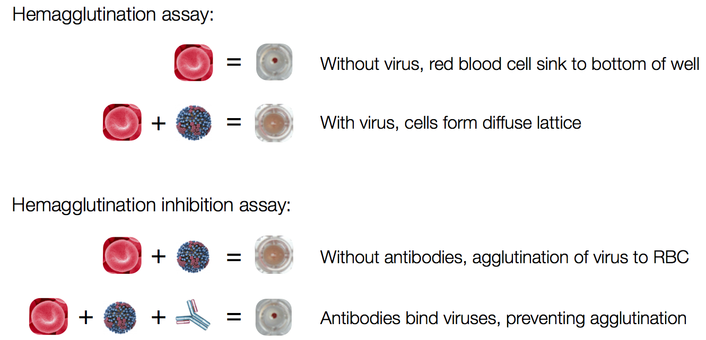
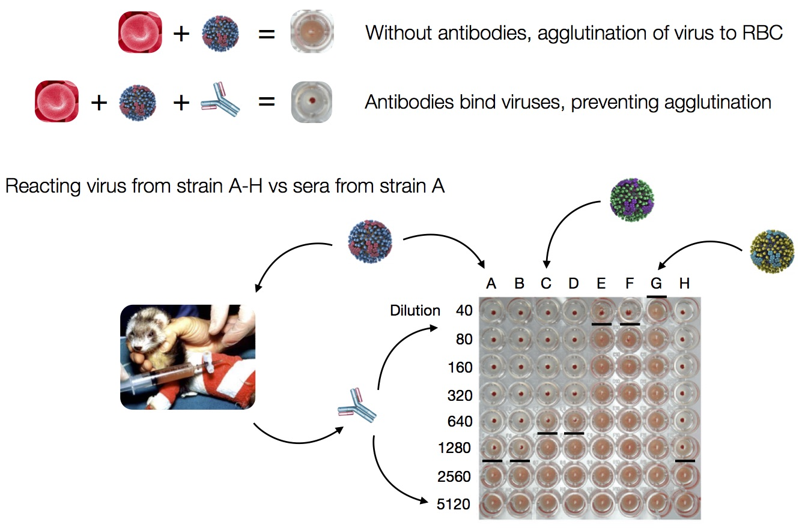

血清学测定法（serological assays）测量结合或中和特定抗原的抗体。

抗原会刺激抗体的产生，当抗原失活时，抗体也随着会消失，但当同样的抗原再次暴露时，抗体产生会更加迅速以及强度会更大。

+ 没有病毒的情况下，红血细胞沉积在底部，呈现小红点
+ 有病毒的情况下，血球凝集蛋白（hemagglutinin）会结合红血细胞，凝聚成网状结构，而悬浮在溶液中。
+ 加入抗体之后，抗体结合病毒，阻止了血凝现像

实验时将对含有抗体的待测血清做连续稀释，并加入定量的病毒（约4-8 HA units）及红血细胞，能抑制血球凝集的最高血清稀释倍率即为血球凝集抑制效价（HI titer）。

<https://bedford.io/projects/phylodynamics-lecture/flu.html>

